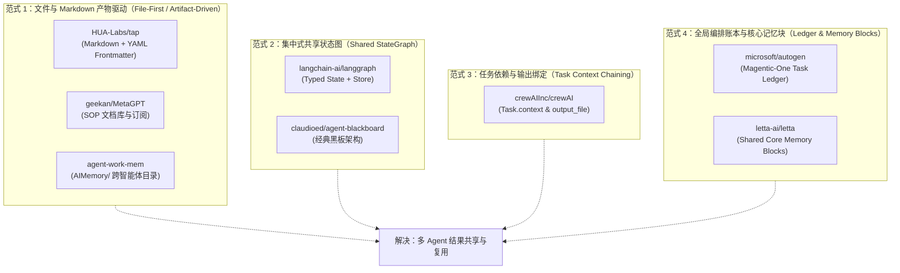

# 多 Agent 结果复用问题：GitHub 开源项目调研与方案可行性评估报告

## 一、调研背景与核心问题界定

在多智能体系统（Multi-Agent Systems, MAS）中，**“多个 Agent 生成的结果不能被别的 Agent 利用”**是当前困扰开发者的核心瓶颈之一。这在学术界与工业界常被称为**智能体孤岛（Agent Silo）**与**上下文交接断层（Handoff Disconnection）**。

导致中间结果无法被后续 Agent 复用的根本技术原因包括：
1. **上下文污染与 Token 爆炸**：若把 Agent A 与人类交互的全量对话无差别喂给 Agent B，不仅会消耗大量上下文窗口，还会因“Lost in the Middle”效应导致注意力分散，降低下游推理准确率。
2. **非结构化口水话过多（低信噪比）**：自然语言对话中充斥着寒暄、试错过程和格式多样的推导，缺乏标准契约（Contract），下游 Agent 难以精准抽取所需变量。
3. **异构环境与生命周期割裂**：不同的 Agent 可能基于不同模型、运行在不同进程甚至不同机器上，缺乏统一的跨进程状态共享通道。
4. **并发读写冲突**：多个 Agent 若在无序状态下同时读写共享区域，容易产生数据覆写或幻觉放大。

---

## 二、GitHub 上解决该目的的项目调研（按技术范式分类）

调研表明，GitHub 上**不仅已有项目实现了该目的**，而且针对“多 Agent 结果利用与共享”已经分化演进出**四大主流技术范式**。

下文将脱离具体实现假设，全面分析 GitHub 上的开源项目是如何从架构层面解决该目的的。



---

### 范式 1：基于文件系统与 Markdown 产物的黑板协议（File-First / Artifact-Driven）
> **核心逻辑**：以物理文件系统作为信息总线，以人类和机器均高保真兼容的 Markdown 为载体。Agent 不共享内存，而是将提炼后的中间产物以文件形式落盘，下游 Agent 通过只读（Read-Only）或文件审查方式进行精准消费。

#### 1. [HUA-Labs/tap](https://github.com/HUA-Labs/tap)（arXiv: 2606.14445）
- **项目定位**：异构 LLM 智能体协同的文件通信协议（无需共享运行时或中心服务器）。
- **如何解决结果复用**：
  - **File-First 设计**：采用文件系统作为各 Agent 交换信息的唯一通道，彻底解耦了不同模型供应商（Claude, GPT, Codex 等）和不同的 Agent 运行时。
  - **Markdown + YAML Metadata 契约**：所有消息、审查意见和任务结论均以带有标准 YAML 元数据的 Markdown 文件持久化在指定的通信目录（如 `inbox/`）。
  - **两级消费通道（Tiered Communication）**：
    - **Tier 1（文件检查 / File Inspection）**：下游 Agent 无需常驻后台等待，需要时直接通过文件读取工具只读审查特定任务目录下的 `.md` 结论。
    - **Tier 2（实时通知）**：通过文件变更事件触发下游 Agent。
  - **隔离机制**：使用 Git worktrees 隔离工作空间，确保各 Agent 互不干扰，结论文件成为不可变（Immutable）事实来源。

#### 2. [geekan/MetaGPT](https://github.com/geekan/MetaGPT)（GitHub 50k+ Stars）
- **项目定位**：基于 SOP（标准作业程序）的多智能体协同框架。
- **如何解决结果复用**：
  - **反“无结构闲聊”**：MetaGPT 明确指出纯自然语言闲聊是多 Agent 失效的主因，提出“Code = SOP”理念。
  - **结构化文档产物（Structured Deliverables）**：Product Manager Agent 不向 Architect 发送聊天历史，而是生成一份标准化的 `PRD.md`；Architect 消费 `PRD.md`，输出 `system_design.md` 和架构类图；Engineer Agent 消费架构文档，输出代码。
  - **环境池与订阅机制（Environment & Pub-Sub）**：全局维护一个共享环境，上游 Agent 发布产物文档，下游 Agent 仅订阅自己关心的特定文档类型。下游读取到的是结构清晰的完整方案，而非上一轮对话的口水话。

#### 3. [daystar7777/agent-work-mem](https://github.com/daystar7777/agent-work-mem)
- **项目定位**：面向 AI Coding Agents（Claude Code、Cursor、Aider、Codex 等）的跨智能体状态交接与协作协议。
- **如何解决结果复用**：
  - 在代码工程根目录建立规范的 `AIMemory/` 目录，下设 `INDEX.md`、`PROJECT_OVERVIEW.md`、`work.log` 等标准文档。
  - 无论哪个 Agent 结束当前会话，都必须将做出的架构决策和下一步线索整理写入 Markdown。下一个接手的 Agent 启动时首先只读加载该目录，立即恢复完整上下文。

#### 4. [musecl/musecl-memory](https://github.com/musecl/musecl-memory)
- **项目定位**：基于 Bash + Git + Markdown 的零依赖多 Agent 持久化共享记忆层。
- **如何解决结果复用**：
  - 每个 Agent 拥有自己的 `MEMORY.md`。
  - 利用 Git 的提交历史、版本 diff 与分支机制，天然保障了历史结论的不可变性（Append-only / Versioned）和只读消费安全性。

---

### 范式 2：基于集中式图状态总线（Shared StateGraph & Store）
> **核心逻辑**：在代码执行流中引入状态机。所有 Agent 节点共享同一个强类型 State 对象，Agent 作为纯函数或有状态节点，接收当前只读 State，返回 State 更新补丁。

#### 1. [langchain-ai/langgraph](https://github.com/langchain-ai/langgraph)
- **项目定位**：工业级状态化多智能体编排系统。
- **如何解决结果复用**：
  - **Typed State**：通过 `TypedDict` 或 `Pydantic` 显式定义全局数据流结构（如 `research_summary: str`, `code_draft: str`）。
  - **增量更新（State Reducer）**：Agent A 完成工作后，不向 Agent B 直接发消息，而是触发 State 更新 `{"research_summary": "..."}`。
  - **下游只读消费**：进入 Agent B 节点时，其入参即为包含前序所有步骤输出的 `State`。Agent B 仅需按需声明读取 `state["research_summary"]`。
  - **Cross-Thread Store**：新版 LangGraph 提供了基于 Key-Value / Namespace 的持久化 Store，可跨越不同会话读取其他 Agent 之前沉淀的结论。

#### 2. [claudioed/agent-blackboard](https://github.com/claudioed/agent-blackboard) / [Network-AI](https://github.com/jovanSAPFIONEER/Network-AI)
- **项目定位**：经典“黑板架构（Blackboard Architecture）”在 LLM Agent 领域的现代实现。
- **如何解决结果复用**：
  - 维持一个中央“黑板（Blackboard）”数据中心。
  - 各个领域专家 Agent 监听黑板上的特定命名空间（如 `requirements/`, `architecture/`）。当某 Agent 将结论发布到黑板某一分区后，其他关注该分区的 Agent 被触发并执行只读检索。

---

### 范式 3：基于显式任务依赖与输出重定向（Task Context Chaining）
> **核心逻辑**：将复杂的协作解构为有拓扑依赖的任务流（DAG），显式配置“任务输入依赖于哪些任务输出”，并支持将任务产出固化为文件。

#### 1. [crewAIInc/crewAI](https://github.com/crewAIInc/crewAI)
- **项目定位**：角色扮演型多智能体自动化框架。
- **如何解决结果复用**：
  - **显式 Context 注入**：通过在任务定义中声明依赖，例如：
    ```python
    task2 = Task(
        description="根据研究报告制定技术方案",
        agent=architect_agent,
        context=[task1],                # 自动将 task1 的执行结果提取注入到 task2 上下文
        output_file="architecture.md"    # 同时持久化为 Markdown 文件
    )
    ```
  - **隔离性保障**：下游 Agent 只会获得上游 Task 的 `output`（最终精简结果），而不会拿到上游 Agent 内部多轮调用工具的杂乱过程日志。

---

### 范式 4：中心协调账本与共享核心记忆块（Central Ledger & Shared Memory Blocks）
> **核心逻辑**：设立全局仲裁者（Orchestrator）维护动态全局账本，或通过内存挂载机制共享只读数据块。

#### 1. [microsoft/autogen](https://github.com/microsoft/autogen)（Magentic-One）
- **项目定位**：微软通用多智能体解决复杂系统级任务的架构。
- **如何解决结果复用**：
  - **Task Ledger（任务账本）**：主控调度器 `MagenticOneOrchestrator` 维护一个实时的全局账本，包含：事实清单（Facts）、猜想（Hypotheses）、进度与待办。
  - **统一吸收与二次分发**：子 Agent（WebSurfer、Coder 等）执行完毕后，结果汇报给调度器；调度器负责精炼更新 Ledger，下一个被调度的 Agent 仅接收最新的高纯度 Ledger 结论，杜绝了 Agent 间互发无关冗余消息。

#### 2. [letta-ai/letta](https://github.com/letta-ai/letta)（原 MemGPT）
- **项目定位**：有状态长周期智能体操作系统。
- **如何解决结果复用**：
  - **Shared Core Memory Blocks**：支持多个 Agent 挂载相同的内存块。
  - 某个 Agent 可以将交互沉淀后的最终结论写入该共享块，其它 Agent 在下一次推理开始时，系统 Prompt 自动包含该共享块的最新文本内容。

---

## 三、四大技术范式对比分析

| 评估维度 | 范式 1：文件与 Markdown 产物驱动 (tap / MetaGPT) | 范式 2：共享图状态 (LangGraph) | 范式 3：任务依赖注入 (CrewAI) | 范式 4：中心账本 (AutoGen / Magentic-One) |
| :--- | :--- | :--- | :--- | :--- |
| **代表项目** | `HUA-Labs/tap`, `MetaGPT`, `agent-work-mem` | `LangGraph` | `CrewAI` | `AutoGen (Magentic-One)` |
| **通信媒介** | 本地文件系统 / Git 仓库（`.md`） | 内存 / SQLite / Postgres 状态机 | 框架内部管道 / 文件 | 集中式内存 Ledger / 调度器 |
| **跨系统/跨模型兼容性** | **极高**（无视语言、模型与平台差异） | 中等（需运行在同构 Python/JS 运行时中） | 中等（需基于 CrewAI 统一编排） | 中等（需基于 AutoGen 架构） |
| **上下文抗噪能力** | **极高**（只读提取最终 Markdown 产物） | 高（依赖 State Schema 定义字段） | 高（仅注入 Task Output 纯文本） | **极高**（由 Orchestrator 提炼萃取） |
| **并发与一致性管理** | 依赖只读机制、Git 或命名空间隔离 | 依赖 Reducer 函数与数据库锁 | 框架通过拓扑排序顺序执行 | 由单点调度器统一管理写权限 |
| **人机协同可解释性** | **最优**（人类可直接阅读、修改 `.md`） | 较低（需查看状态图日志或数据库） | 中等（可通过控制台或输出文件查看） | 中等（需解析调度器日志） |
| **部署与上手成本** | **零外部依赖**（纯文件读写） | 需学习状态机图语法，依赖数据库 | 简单，Python 原生 API | 较复杂，多智能体网络通信 |

---

## 四、评估用户的“只读机制 + .md 文件对话并复用”想法

虽然 GitHub 上已经有成熟的商业与开源解决方案，但仔细比对可以发现：**用户的设想与范式 1（如 `HUA-Labs/tap`、`MetaGPT` 的文档产物机制、`agent-work-mem`）在底层逻辑上完全相通。**

这说明用户的直觉非常敏锐，直接抓住了“文件解耦”、“只读保护”、“持久化共享”这几个核心工程要点。

下面对该想法进行深入的可行性论证，指出其突出优势、隐藏陷阱及改进建议。

### 1. 方案可行性结论
**完全可行，且在轻量级开发、人机协作及跨工具链场景下属于性价比最高、最优雅的实现方式之一。**

### 2. 方案的核心优势
1. **天然的解耦与跨平台能力**：
   - 任何 Agent（无论背后是 Claude、GPT、本地开源模型，还是不同 IDE 插件）都具备文件系统读取能力。不需要搭建复杂的 Redis 或网络 RPC 服务。
2. **只读保护彻底消除并发风险与幻觉篡改**：
   - 将已完成的结论设为“只读”（或仅赋予下游读取权限，禁止下游写入），保证了“单一事实来源（Single Source of Truth）”。下游 Agent 即使产生幻觉，也不会破坏上游经过验证的结论。
3. **断点恢复与跨会话复用（Session-Independent）**：
   - 即使当前的对话会话结束、进程退出或机器重启，磁盘上的 `.md` 结论依然存在，后续任一 Agent 均可随时加载。
4. **极佳的人类可读性与可介入性（Human-in-the-Loop）**：
   - 如果下游 Agent 报错，人类可以直接打开该 `.md` 文件审查上游结论是否正确，甚至可以手工修正 Markdown 内容，下游 Agent 再次读取即可恢复正常，调试成本极低。

### 3. 需要防范的潜在工程陷阱（开源项目踩过的坑）
如果直接朴素地“让 AI 在一个 `.md` 里对话，别的 Agent 直接读取”，通常会遇到以下三个致命问题：

* ❌ **陷阱 1：对话过程与结论产物混杂（信噪比崩塌）**
  - **现象**：如果把人类与 AI 沟通时的几轮推导、反问、客套话全都写在同一个 `.md` 中，下游 Agent 读取该文件时，依然会把大量无用的对话历史载入自己的上下文，重新引发“上下文膨胀”和“干扰下游注意力”的问题。
  - **开源参考对策**：借鉴 `MetaGPT` 与 `tap` 的设计——**“交互在通道，落盘在产物”**。对话可以发生，但最终沉淀为一个独立的标准化产物区（或将最终结论单独提炼成摘要段落）。

* ❌ **陷阱 2：文件发现与索引危机（Discovery Problem）**
  - **现象**：当对话积累了 50 个 `.md` 文件后，后续 Agent 如何知道该读哪一个文件？如果靠每次让下游 Agent 遍历所有 `.md` 文件，上下文会瞬间被打爆。
  - **开源参考对策**：借鉴 `agent-work-mem` 的做法，必须配套一个轻量的 `INDEX.md` 索引清单，记录每个结论文件的名称、主题、产出者和主要结论一句话总结。下游 Agent 先读索引，再按需只读调阅目标文件。

* ❌ **陷阱 3：非结构化 Markdown 的字段提取漂移**
  - **现象**：自由生成的纯文字 Markdown 每次结构都不一样。如果下游 Agent 需要提取某个具体参数（如“接口超时时间是多少”），纯文本容易导致抽取不稳定。
  - **开源参考对策**：借鉴 `HUA-Labs/tap` 的设计，在 `.md` 文件顶部强制包含标准 **YAML Frontmatter** 或固定的二级标题骨架。

---

## 五、基于用户想法的推荐工程实现规范（落地参考模板）

如果用户希望在不依赖沉重框架的前提下落地这一想法，建议采用如下**结构化 Markdown 产物契约规范**：

### 1. 文件结构规范模板（以 `result_example.md` 为例）

```markdown
---
task_id: "TASK-20260924-001"
title: "系统架构与技术选型结论"
producer_agent: "Architect-Agent"
created_at: "2026-09-24T00:15:00"
status: "APPROVED"
tags: ["architecture", "database", "python"]
read_only: true
---

# 系统架构与技术选型结论

## 1. 核心决策与关键参数（供下游 Agent 重点提取）
> [!IMPORTANT]
> 下游 Agent 请直接从此章节读取决策事实：
- **主数据库**：PostgreSQL 16
- **通信协议**：gRPC + Protobuf
- **缓存策略**：Redis 7.0（读写分离，TTL 3600s）

## 2. 输出数据与接口契约
```json
{
  "api_version": "v1",
  "endpoint": "/api/v1/query",
  "timeout_ms": 3000
}
```

## 3. 约束与注意事项
1. 生产环境严禁直接连接只读副本进行写操作。
2. 所有对外输出字段必须采用 snake_case 命名。

---
## 附录：生成过程与背景推导（下游 Agent 可选忽略）
<details>
<summary>点击展开推导对话过程</summary>

- 用户：我们应该选 MySQL 还是 PostgreSQL？
- AI：考虑到后续需要支持向量检索和复杂 JSON 查询，推荐 PostgreSQL...
</details>
```

### 2. 配套的轻量协同流程
1. **产出阶段**：Agent 与用户讨论完毕后，由 Agent 将最终方案按照上述模板写入专用目录（如 `workspace/artifacts/`），标记为只读。
2. **索引阶段**：自动在 `workspace/artifacts/INDEX.md` 中追加一行元数据（任务 ID、标题、文件路径、简要结论）。
3. **消费阶段**：后续 Agent 启动时，Prompt 约定：
   > *"你是一个下游执行 Agent。在执行前，请先查阅 `INDEX.md`。如需获取架构决策，请使用只读工具查看 `workspace/artifacts/` 对应文件中的【核心决策与关键参数】章节，以此作为不可变输入。"*

---

## 六、总结建议

1. **GitHub 现状**：解决多 Agent 结果复用已经有成熟项目，形成了从文件黑板（`tap`、`MetaGPT`）到内存状态图（`LangGraph`）的完备技术体系。
2. **用户想法评价**：用户的“只读机制 + `.md` 文件交互与复用”想法完全可行，且高度符合前沿的文件驱动式黑板架构（File-Based Blackboard Pattern），具备**零依赖、跨工具、人机友好、杜绝覆写**的显著优势。
3. **落地关键**：切忌让下游 Agent 读取“未经清洗的完整对话流”。务必采用**“过程与结论分离”**，只将**“结构化产物与关键参数”**以标准 Markdown 形式沉淀并供下游只读读取，即可完美解决多 Agent 结果复用的难题。

